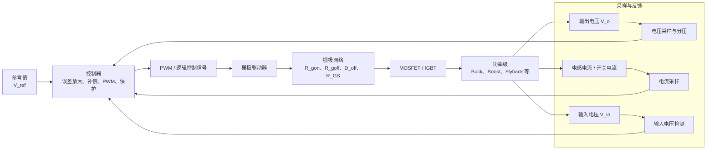

在前面的章节中，我们已经讨论了 Buck、Boost、Flyback 等基础拓扑的开关状态、能量传递过程，以及如何利用 PSS 条件推导输入输出关系。

但是，一个实际变换器不能只依靠固定占空比工作。

当输入电压变化、负载变化、器件参数漂移或环境温度变化时，固定占空比通常无法持续维持目标输出电压。因此，实际电源需要不断测量系统状态，并据此调节开关器件的导通与关断过程。

一个完整的受控开关电源可以概括为：

其中：

- 控制器决定开关器件应当在什么时刻导通、导通多久，以及何时停止工作；
- 栅极驱动器负责将控制器的低功率逻辑信号，转换为能够快速充放栅极电荷的驱动信号；
- 采样网络负责把输出电压、电感电流、开关电流或输入电压转换为控制器能够识别的信号；
- 补偿网络决定闭环系统是否稳定，以及面对负载变化时响应得多快；
- 栅极网络和 PCB 布局决定驱动命令能否在真实功率器件上被可靠执行。

---

## 6.1 控制器与栅极驱动器

### 6.1.1 控制器：决定功率级应当怎样工作

控制器关注的是变换器的平均行为。

例如：

- 输出电压是否高于或低于目标值；
- 电感电流是否超过允许范围；
- 输入电压是否过低或过高；
- 当前是否允许启动；
- 是否发生过流、过压或过温故障；
- 下一周期应当采用多大的占空比。

控制器的输出通常只是一个低功率的PWM 信号。

但控制器本身不一定具有足够的峰值输出电流，不能直接可靠地驱动大功率 MOSFET 或 IGBT 的栅极。

### 6.1.2 栅极驱动器：让功率器件真正完成开关

栅极驱动器接收控制器的逻辑信号，并在功率器件栅极附近完成以下任务：

- 向栅极提供较大的充电电流，使器件快速开通；
- 从栅极抽取较大的放电电流，使器件快速关断；
- 将逻辑侧信号转换到合适的栅极驱动电压；
- 对高边器件提供浮动或隔离的驱动参考；
- 在驱动电源不足时禁止开关；
- 参与死区、短路、欠压和故障关断保护。

因此可以概括为：

控制器：
决定应不应该开、什么时候开、开多久。

驱动器：
负责怎样可靠地驱动栅极。

### 6.1.3 控制器与驱动器可能集成，也可能分离

在功率较低、拓扑简单的场合，一个芯片中可能同时包含：

- 反馈控制；
- PWM 产生；
- 栅极驱动输出；
- 软启动；
- 保护功能。

在功率较高、开关频率较高、器件栅极电荷较大，或需要高边与隔离驱动时，通常会将控制器和栅极驱动器分开：
控制器
→ 低压逻辑 PWM
→ 独立栅极驱动器
→ 栅极网络
→ 功率 MOSFET / IGBT

---

## 6.2 常见电源控制芯片的功能类型

本节讨论电源领域中常见的控制芯片类型，以及它们通常解决什么问题。

### 6.2.1 基础 PWM 控制器

基础 PWM 控制器常用于：

- Buck；
- Boost；
- Buck-Boost；
- Flyback；
- Forward；
- 其他单开关 DC-DC 变换器。

它通常包含以下功能模块：

- 参考电压源
- 误差放大器
- PWM 比较器
- 振荡器或频率设定模块
- 软启动模块
- 使能控制
- 欠压锁定
- 过流保护
- 故障自动重启
- PWM 输出

其基本工作过程可以概括为：

输出电压被采样
→ 与参考值比较
→ 得到输出电压误差
→ 控制器根据误差调整 PWM 占空比
→ 功率级平均传递的能量改变
→ 输出电压重新回到目标值附近

### 6.2.2 电压模式控制器

电压模式控制器主要根据输出电压误差调节占空比。

其基本结构为：

输出电压
→ 分压
→ 误差放大器
→ 补偿网络
→ PWM 占空比

若输出电压偏低，则误差放大器输出通常会提高，使 PWM 占空比增加；若输出电压偏高，则占空比减小。

这种控制方式的核心变量是输出电压。

### 6.2.3 电流模式控制器

电流模式控制器除测量输出电压外，还会测量电感电流或开关电流。

其基本结构为：

输出电压误差
→ 外电压环
→ 电流指令

电感电流 / 开关电流
→ 电流采样
→ 与电流指令比较
→ 达到阈值时关断开关

因此，电流模式控制通常可以理解为：

外环控制电压误差消除。

内环通过调整输出电流，来让电压变化从而满足外环需求。

对于 Buck、Boost 和 Flyback，电感电流或开关电流都与每周期的能量传递直接相关，因此电流模式控制在这些拓扑中非常常见。

### 6.2.4 CCM 与 DCM 的基本说明

控制芯片的工作方式通常取决功率级的导通模式。

在连续导通模式 CCM 中：

$$
i_L(t)>0
$$

电感电流在一个开关周期结束前不会降为零。

在不连续导通模式 DCM 中：

$$
i_L(t)=0
$$

电感电流会在下一周期开始前下降到零，并保持一段零电流区间。

对于 Flyback 而言，也可以用励磁电流 $i_m$ 来区分：

CCM：
下一周期开始前，励磁电流尚未降为零。

DCM：
下一周期开始前，励磁电流已经降为零。

这里不展开不同模式下的完整控制理论，但必须建立一个基本认识：

> 控制器发出的 PWM 信号相同，不意味着功率级一定工作在相同模式。负载、电感量、输入电压和开关频率都会影响变换器处于 CCM 还是 DCM。如一些控制器在轻载情况下虽然PWM信号的占空比不变，但是进入DCM。

### 6.2.5 隔离型反馈控制器

在 Flyback、Forward 等隔离型变换器中，输出电压位于副边，而控制器往往位于原边。

于是出现一个问题：

> 输出侧测得的电压误差，由于它们没有公共的地作为参考，怎样送回原边控制器？

一种典型结构为：

输出电压 V_o
→ 电阻分压
→ 副边误差放大器
→ 光耦
→ 原边控制器 FB 或 COMP 引脚
→ 改变 PWM 占空比或峰值电流

这类结构中：

- 输出侧测量需要稳定的输出电压；
- 光耦跨越隔离屏障传递误差信息；
- 原边控制器根据该误差信息调节开关器件。

另一类方案是通过辅助绕组间接估计输出电压，实现原边侧调节。它可以减少光耦，但输出精度通常更依赖绕组耦合、器件压降和负载条件。

---

## 6.3 常见栅极驱动芯片的功能类型

### 6.3.1 低边驱动器

低边驱动器适用于功率器件源极或发射极接近功率地的场合，例如：

- Boost 主开关；
- Flyback 原边 MOSFET；
- 单管 Forward 主开关；
- 某些 Buck 的低边同步 MOSFET。

典型连接关系为：

控制器 PWM
→ Driver IN

驱动电源 VDRV
→ Driver VDD

Driver OUT
→ 栅极网络
→ MOSFET Gate

Driver GND
→ MOSFET Source 的局部参考点

### 6.3.2 高低边半桥驱动器

同步 Buck 和 Half-Bridge 中通常存在上下两个开关器件。

此时需要：

高边驱动：
相对于高边 MOSFET 的 Source 驱动 Gate。

低边驱动：
相对于系统低侧参考点驱动 Gate。

高边器件的源极会随着开关节点快速变化，因此需要一个建立在源极基础上的驱动电压。

高边驱动必须保证：

$$
V_{GS}=V_G-V_S
$$

处于器件要求的驱动范围内。

也就是说，即使高边源极已经上升到较高电压，驱动器仍需让高边栅极保持比源极更高的电压，才能维持器件导通。

### 6.3.3 隔离驱动器

隔离驱动器适用于：

- 高压 Flyback；
- 高压 Half-Bridge；
- Full-Bridge；
- 高压 IGBT；
- SiC MOSFET；
- 输入控制侧与功率侧必须电气隔离的场合。

它通常把驱动器分为两个参考域：

逻辑侧：
控制器 PWM、低压控制电源、数字地。

功率侧：
栅极输出、功率侧驱动电源、MOSFET Source 或 IGBT Emitter。

隔离驱动器能够让逻辑侧不直接承受功率侧的大幅度共模电压变化。

但必须注意：

> 隔离驱动器需要单独的栅极驱动电源。

这会大大增加体积。隔离电源模块通常较大。

---

## 6.4 采样：究竟应该测量什么、在哪里测量？

控制器只能分析接到引脚上的电压或电流信号。这来源于采样位置。

因此，采样位置决定了控制器到底在控制什么。

### 6.4.1 输出电压采样

对于 Buck、Boost 和 Flyback 等输出稳压变换器，最基本的采样量是输出电压：

$$
V_o
$$

输出电压通常应在以下位置采样：

输出滤波之后
输出电容两端
接近负载实际接入点

### 6.4.2 为什么 FB 节点不能随意布线？

`FB` 节点通常是高阻、低幅值且对噪声敏感的模拟节点。

它容易受到以下干扰：

- 开关节点的高 $dv/dt$ 电容耦合；
- 栅极驱动回路中的高峰值电流；
- 大电流回流造成的地电位扰动；
- 变压器原副边寄生电容耦合；
- 二极管反向恢复和开关振铃。

因此，FB 网络应遵循以下原则：

1. 分压电阻尽量靠近控制器 FB 引脚布置；
2. FB 回流应接到干净的模拟地；
3. 不要让 FB 走线贴近开关节点；
4. 不要让 FB 走线与栅极驱动走线长距离并行；
5. 高压输出使用分压电阻串联时，应同时检查耐压、功耗和爬电距离；
6. 若加入滤波电容，必须确认它不会破坏补偿网络的设计。

### 6.4.3 电流采样

电流采样的目的通常包括：

- 形成电流模式控制的内环；
- 实现逐周期限流；
- 实现短路保护；
- 监测输出电流；
- 判断轻载、过载或工作模式。

不同拓扑中，电流采样位置不同。

| 拓扑 | 常见采样对象 | 采样意义 |
|---|---|---|
| Buck | 输出电感电流、低边电流 | 表示输出能量传递状态 |
| Boost | 输入电感电流、主开关电流 | 表示输入侧每周期储能量 |
| Flyback | 原边 MOSFET 电流 | 表示励磁电流和每周期储能量 |
| Forward | 输出电感电流或原边电流 | 分别服务于输出调节或原边保护 |

### 6.4.4 电流采样中的尖峰与消隐

开关器件刚导通或刚关断时，电流采样波形中可能出现很窄的尖峰。

这些尖峰可能来自：

- 二极管反向恢复；
- MOSFET 输出电容充放电；
- 漏感与寄生电容振铃；
- 大电流回路的寄生电感；
- 采样回路布局不合理。

如果控制器在尖峰出现的瞬间立即判断过流，可能发生误触发。

因此，一些控制器会在开关导通后的短时间内忽略电流采样信号，这段时间称为前沿消隐时间。

### 6.4.5 输入电压采样

输入电压采样常用于：

- 欠压锁定；
- 输入过压保护；
- 启动条件判断；
- 输入电压前馈；
- 限制占空比或功率范围。

例如，当输入电压低于设计允许值时，控制器可以禁止启动，避免系统在输入不足时反复启动、输出异常或电流过大。

---

## 6.5 反馈网络与补偿网络

输出反馈网络和补偿网络经常同时围绕 `FB`、`COMP` 等引脚出现

分压网络：
决定控制器得到的反馈信号，决定多大的输出电压。

补偿网络：
决定控制器根据误差作出多快、是否稳定的调节。

>补偿网络具体的选型需要结合控制理论的相位裕度增益裕度来看。但是通常具有一些参考值可以选择。

### 6.5.1 分压网络：确定直流输出设定值

分压网络的基本任务是把高于控制器输入范围的输出电压缩小为内部参考电压附近的信号。

若输出目标值为 $V_o$，而控制器反馈基准为 $V_{REF}$，则应设计：

$$
V_{FB}
=
V_{REF}
$$

即：

$$
V_o
=
V_{REF}
\left(
1+\frac{R_{top}}{R_{bot}}
\right)
$$

### 6.5.2 COMP 节点：控制器如何形成调节动作

许多模拟控制器内部包含误差放大器。

其基本工作过程为：

FB 电压低于参考值
→ 输出电压偏低
→ 误差放大器输出变化
→ COMP 电压变化
→ PWM 占空比或峰值电流阈值变化
→ 功率级传递能量增加
→ 输出电压恢复

`COMP` 通常是误差放大器输出端，也是补偿网络连接的位置。

### 6.5.3 补偿网络为什么必要？

功率级本身具有动态特性。

例如，Buck 的输出端包含电感和电容；当占空比改变时，输出电压不会立即改变，而是经历能量积累、释放和滤波过程。

如果控制器对误差反应过快或相位关系不合适，系统可能出现：

- 输出振荡；
- 负载变化后反复过冲和欠冲；
- 启动不稳定；
- 轻载抖动；
- 对输入扰动反应异常。

---

## 6.6 栅极驱动网络

栅极驱动器的输出不能简单直接接到功率 MOSFET 栅极。

通常需要在驱动器与栅极之间加入栅极网络，以控制开通和关断的速度，并保证驱动器失效时器件保持关断。

一个基础栅极网络可以表示为：

![[gatedri.png]]

其中：

- $R_{gon}$ 为开通栅极电阻；
- $R_{goff}$ 为关断栅极电阻；
- $D_{off}$ 为关断二极管；
- $R_{GS}$ 为栅源下拉电阻。

### 6.6.1 开通时的电流路径

驱动器输出拉高时，栅极电荷经以下路径充入：

Driver OUT
→ R_gon
→ Gate
→ MOSFET 栅极电容
→ Source
→ Driver GND

$R_{gon}$ 主要影响：

- 开通延迟；
- 漏极电压下降速度；
- 开通电流上升速度；
- 二极管反向恢复应力；
- 开通损耗；
- 开关节点振铃；
- EMI。

### 6.6.2 关断时的电流路径

驱动器输出拉低时，栅极中原有的电荷需要被快速抽走。

此时电流路径为：

Gate
→ D_off
→ R_goff
→ Driver OUT
→ Driver GND

因此，关断过程主要由 $R_{goff}$ 决定。

在上图中，$D_{off}$ 的方向应保证：

开通时：
Driver OUT → Gate 的电流不能通过 D_off。

关断时：
Gate → Driver OUT 的电流能够通过 D_off。

分开设置 $R_{gon}$ 与 $R_{goff}$ 的目的，是让开通速度和关断速度能够独立调整。

### 6.6.3 栅源下拉电阻 $R_{GS}$

$R_{GS}$ 连接在栅极和源极之间。

它的主要作用是：

- 驱动器未上电时，使栅极保持在源极附近；
- 驱动器输出高阻时，避免栅极悬空；
- 泄放少量漏电和耦合电流；
- 降低器件意外导通的风险。

$R_{GS}$ 不应过小，否则会增加驱动器开通时的静态负担；也不应过大，否则其下拉能力不足。

---

## 6.7 栅极电阻如何理解与选择？

功率器件每次开关时，驱动器都需要搬运一定栅极电荷：

$$
Q_g
$$

若希望在时间 $t_{sw}$ 内完成主要的栅极充电过程，则平均栅极电流量级可以粗略估算为：

$$
I_g
\approx
\frac{Q_g}{t_{sw}}
$$

栅极电阻决定栅极回路的峰值电流和充放电速度。

总栅极回路电阻包括：

$$
R_{g,{total}}
=
R_{drv}
+
R_{g,{ext}}
+
R_{g,{int}}
+
R_{trace}
$$

其中：

- $R_{drv}$ 为驱动器输出等效电阻；
- $R_{g,{ext}}$ 为外接栅极电阻；
- $R_{g,{int}}$ 为器件内部栅极电阻；
- $R_{trace}$ 为 PCB 走线和封装互连的等效电阻。

栅极电阻越小，通常意味着：

开关更快
开关损耗可能更低
但 dv/dt 和 di/dt 更大
过冲和振铃可能更明显
EMI 可能更严重
误导通风险可能增加

栅极电阻越大，通常意味着：

开关更慢
过冲和 EMI 可能减小
但开关损耗可能增加
器件温升可能增加

因此，栅极电阻的选择本质上是在以下目标之间折中：

效率
器件电压过冲
器件电流过冲
二极管反向恢复
EMI
误导通裕量
驱动器峰值电流能力

实际设计中，可以先依据器件栅极电荷、驱动电压和目标开关速度给出初始值，再通过波形测量调整。

---

## 6.8 Miller 效应与误导通

MOSFET 栅极与漏极之间存在 Miller 电容：

$$
C_{GD}
$$

当 MOSFET 漏源电压快速变化时，会通过该电容向栅极注入或抽取电流：

$$
i_{Miller}
=
C_{GD}
\frac{\mathrm dV_{DS}}{\mathrm dt}
$$

在半桥中，当一只 MOSFET 快速开通或关断时，另一只本应关断的 MOSFET 的开关节点也会随之快速变化。

若 Miller 电流经过栅极回路阻抗后，使关断器件的栅源电压上升到阈值附近：

$$
V_{GS}
\geq
V_{th}
$$

则该器件可能发生误导通。

若上下两个器件同时导通，就可能形成直通电流：

直流母线正端
→ 上管
→ 下管
→ 直流母线负端

这类故障电流通常非常大，可能迅速损坏开关器件。

可以按以下优先顺序处理。

1. 缩小功率开关回路面积；
2. 缩小 Gate-Source 驱动回路面积；
3. 驱动器紧贴功率器件；
4. 使用 Kelvin Source 或 Kelvin Emitter；
5. 提高关断下拉能力；
6. 合理减小 R_goff；
7. 采用独立的开通与关断电阻；
8. 加入 R_GS 下拉电阻；
9. 必要时使用 Miller Clamp；
10. 必要时使用负压关断；
11. 必要时降低开关速度，减小 dv/dt。

其中，前四项主要是在减小寄生参数；后面的措施才是从驱动网络本身进行补救。

### 6.8.2 Miller Clamp

Miller Clamp 是一种栅极关断钳位措施。

其思想是：

> 当器件已经确认关断后，为 Gate 到 Source 或 Gate 到负驱动电源之间提供低阻抗通路，使 Miller 电流优先经该通路泄放，而不是重新抬高 $V_{GS}$。

它尤其适用于：

- 高压半桥；
- SiC MOSFET；
- IGBT；
- 高 $dv/dt$ 的桥式变换器；
- 对误导通裕量要求较高的场合。

Miller Clamp 应尽可能靠近功率器件的 Gate 和 Kelvin Source / Emitter，否则其回路寄生电感会削弱实际效果。

### 6.8.3 负压关断

对于一些高压或高速器件，关断时将拉到一个小的负电压：

$$
V_{GS}<0
$$

这样，即使 Miller 电流使栅极电压上升，器件仍有更大的裕量保持在阈值以下。

但是，负压关断不能随意使用。

必须同时检查：

- 器件允许的最小 $V_{GS}$；
- 驱动器允许的负电源范围；
- 栅极振铃是否会使负压超过器件绝对额定值；
- 驱动电源隔离和布局是否能够支持负压轨。

---

## 6.9 驱动电源与本地去耦

栅极驱动器在开通和关断瞬间需要输出较大的峰值电流。

这些电流不应从远处电源经长导线或长铜箔传来，而应主要由驱动器附近的去耦电容提供。

驱动器供电回路应尽可能小：

Driver VDD
→ 本地去耦电容
→ Driver GND

去耦电容应紧靠驱动器电源引脚布置。

其作用是：

- 在栅极充电瞬间提供局部峰值电流；
- 在栅极放电瞬间吸收回流电流；
- 降低驱动电源振铃；
- 避免驱动电流扰动控制器供电；
- 防止驱动器因瞬态供电下降触发欠压锁定。

驱动电源的平均功耗可粗略估算为：

$$
P_{drv}
\approx
Q_gV_{DRV}f_s
$$

其中：

- $Q_g$ 为单次开关所需栅极电荷；
- $V_{DRV}$ 为驱动电压；
- $f_s$ 为开关频率。

实际驱动电源功耗还应考虑：

- 驱动器静态电流；
- 多个开关器件的总栅极电荷；
- 隔离电源损耗；
- 负压关断支路；
- 故障保护和状态指示等辅助负载。

---

## 6.10 软启动、欠压锁定与过流保护

### 6.10.1 软启动

若电源上电后立即要求输出电压从零跳到目标值，控制器可能在短时间内给出很大的占空比或峰值电流指令。

这会导致：

- 输入浪涌电流过大；
- 输出电容充电电流过大；
- 电感电流过冲；
- 磁件接近饱和；
- MOSFET 和二极管电流应力增加；
- 输出电压过冲。

软启动的基本思想是：

让参考值、COMP 电压或峰值电流阈值逐渐上升。

因此，输出电压和电感电流以受控速度建立。

### 6.10.2 欠压锁定

驱动器或控制器的供电电压不足时，不能保证 MOSFET 获得足够的栅源电压。

若 MOSFET 长时间处于半导通区，其导通损耗会显著增加。

因此，欠压锁定的目的是在驱动电源不足以保证器件可靠导通和可靠关断时，关闭开关动作。

### 6.10.3 逐周期限流

逐周期限流通常根据开关电流或电感电流进行判断。

当本周期电流采样值超过阈值时，控制器立即缩短或终止本周期导通时间。

例如：

$$
V_{CS}
=
i_{sw}R_{CS}
$$

当

$$
V_{CS}
>
V_{CS,th}
$$

时，控制器可以关断主开关。

---

## 6.11 控制地、功率地与 Kelvin 回路

电路图中的所有地符号看起来相同，但 PCB 上的不同地节点并不一定处于相同瞬时电位。

当大电流快速变化时，任何铜箔、电阻和寄生电感都会产生压降：

$$
v
=
Ri
+
L_{ p}
\frac{\mathrm di}{\mathrm dt}
$$

因此，如果控制器的反馈地、采样地和功率开关大电流回流共用一段路径，控制器得到的可能不是实际输出电压或实际采样电阻电压，而是叠加了功率回流噪声的错误信号。

应当区分：

Power GND：
承载开关电流、输入电容电流和功率器件回流。

Analog GND：
作为 FB、COMP、CS 等小信号的参考。

Driver Return：
作为 Gate 驱动电流的局部回流路径。

在最终 PCB 上，这些参考地不一定完全分离，但必须明确各自的电流回路，并在合适的位置进行单点或低阻抗连接。

对于电流采样，Kelvin 连接尤其重要：

采样电阻上端
→ 单独引线
→ CS

采样电阻下端
→ 单独引线
→ 控制器信号地

不要让采样信号与开关大电流共用一段测量回路。

